# 🏗️ Nubimancy Architecture Planning Document

_The Living Chronicle of Our Destination-Driven Development Strategy_

**Last Updated:** 2025-09-28  
**Status:** Active Planning Phase  
**Purpose:** Master planning document for reverse-engineering our perfect end-state architecture

---

## 🎯 **Strategic Overview**

### **The Dual-Track Approach**

- **Track A: "The Great Refactoring Saga"** - Taking existing monolithic PTEs and breaking them into proper AppSource + PTE architecture
- **Track B: "The Greenfield Genesis"** - Building the perfect architecture from scratch
- **Shared Destination:** Fully orchestrated BC ecosystem with AppSourc## 🎯 **Implementation Strategy: Destination-Driven Development**

### **Revolutionary Three-Phase Approach**

_Building the world's first character-driven technical education ecosystem_

**Total Scope:** 38 Applications (19 production + 19 test apps)

- 4 AppSource Applications (Nimbus Core, Supply, Exhibition, Manufacturing)
- 15 PTE Components (hero-specific magical extensions)
- 19 Test Applications (proper "good citizen" development practices)

### **🎯 Object ID Allocation Strategy**

_Cloud Sandbox Compatible - All apps deployable in PTE ranges (50,000-99,999)_

#### **🌟 "AppSource-Style" Foundation Applications**

**Main apps get 800 objects, test apps get 200 objects:**

- **🏰 Nimbus Core Foundation**
  - Main App: `80,000 - 80,799` (800 objects)
  - Test App: `80,800 - 80,999` (200 objects)

- **🚢 Nimbus Supply (Transportation & Communication)**
  - Main App: `81,000 - 81,799` (800 objects)
  - Test App: `81,800 - 81,999` (200 objects)

- **⚔️ Nimbus Exhibition (Competition & Service)**
  - Main App: `82,000 - 82,799` (800 objects)
  - Test App: `82,800 - 82,999` (200 objects)

- **🏭 Nimbus Manufacturing (Manufacturing & Retail)**
  - Main App: `83,000 - 83,799` (800 objects)
  - Test App: `83,800 - 83,999` (200 objects)

#### **⚙️ Hero Business PTEs**

**Main PTEs get 800 objects, test apps get 200 objects:**

**📦 Bran's Transportation PTEs (50,000-52,999):**

- Mystical Route Planning: Main `50,000-50,799` | Test `50,800-50,999`
- Arcane Scroll Processing: Main `51,000-51,799` | Test `51,800-51,999`
- Caravan Festival Coordination: Main `52,000-52,799` | Test `52,800-52,999`

**⚔️ Rini's Combat Sports PTEs (53,000-55,999):**

- Dimensional Tournament Brackets: Main `53,000-53,799` | Test `53,800-53,999`
- Fighter Progression Analytics: Main `54,000-54,799` | Test `54,800-54,999`
- Multi-Realm Sports Broadcasting: Main `55,000-55,799` | Test `55,800-55,999`

**🐾 Weltina's Creature Care PTEs (56,000-58,999):**

- Advanced Creature Care Protocols: Main `56,000-56,799` | Test `56,800-56,999`
- Patron Auction Management: Main `57,000-57,799` | Test `57,800-57,999`
- Multi-Habitat Management: Main `58,000-58,799` | Test `58,800-58,999`

**🪄 Delyra's Multi-Dimensional PTEs (59,000-61,999):**

- Multi-planar Work Centers: Main `59,000-59,799` | Test `59,800-59,999`
- Enchantment Refresh Services: Main `60,000-60,799` | Test `60,800-60,999`
- Portal Shop Management: Main `61,000-61,799` | Test `61,800-61,999`

**🍺 Thorin's Hospitality PTEs (62,000-64,999):**

- Dwarven Ale Quality Tracking: Main `62,000-62,799` | Test `62,800-62,999`
- Tavern Network Relationship Management: Main `63,000-63,799` | Test `63,800-63,999`
- Community Event Orchestration: Main `64,000-64,799` | Test `64,800-64,999`

**🎯 Allocation Benefits:**
✅ **Cloud Deployable** - All apps use PTE-compatible ranges
✅ **Zero Conflicts** - Each app pair has dedicated, non-overlapping ranges
✅ **Right-Sized Design** - 800 objects provides adequate functionality per app
✅ **Efficient Testing** - 200 objects provides comprehensive test coverage
✅ **Hero-Focused** - Each hero gets 3k total objects across their 3 PTEs
✅ **Future Expansion** - Ranges 84,000-99,999 reserved for growth

## GUID Pool for the 38 apps

2ed328c3-0c3f-4d51-a8d4-1d8677ed3f49
b0e99a70-4c1f-4cce-8ebd-5a384191ddb5
2eabad7c-8e84-4267-a87f-ec1074d3b0af
5195420b-74d0-45ce-a543-2c8591ad7920
327b783b-d732-427b-b4f2-842a9058f5a2
377fed02-8b99-40dc-920f-6779ee9c917c
918c7a2e-9ecf-442f-8308-a6ec8948e7ae
34e27c81-9ac6-4c89-9f83-7468d884c202
0fb8da66-7fb6-45bc-baa9-ff44d272ef3a
07962a81-9ebf-4e4c-b78f-bc02213e5216
901c98e5-56bf-4b57-bedb-c6b6916eb74a
039bd969-5321-4ad9-a355-17faa68f07b8
3fa0b022-5335-4fbe-988f-ba1109d4ac1a
46a108f4-1aed-4f00-8170-7e09ad8f1d10
fb53db67-ebce-4f0b-b613-16d73528bd12
73a0d05c-5cd3-43fa-8f98-eaa53856ce09
51b011e0-124a-475d-8376-c08f90759b5e
b9fae4cf-7ee0-4378-9262-9660e5146dc3
7cd7c85f-0c99-4301-a3b0-b57a3c5266ba
2231c6a9-be06-423f-a26a-e6f908d66a26
810ae21c-318f-4853-ba63-81dcc549ecc5
0ba77c69-1063-43f4-b073-aec8045a56e0
0785ab22-d9e9-4c25-9925-b5d0b622ec21
d8a76d98-1e91-4c4a-a62e-d40ca194af5a
5a489c36-7238-4fa0-a328-22402be84090
f83165f1-d58e-4bda-b46d-0301f469898a
54b1513d-dcd5-4120-ae86-d43402ecb8d9
86bba180-31da-40fa-8fd7-7c4747f2f063
8fd0ba48-55b3-4539-9033-143783f09efa
d35bbefa-5680-45d7-9a96-197a2e6b04db
d48474a8-bb04-4cd9-931b-a5ed29056a06
1243b2ce-7e2c-4f82-96a0-21b8f004d44f
34252d21-e044-44c5-8adf-27beda33d522
d9e04fbf-c76d-4635-b2a2-374e6891d0f3
b54cfa8d-9b64-4777-9c1e-8ddd0f15f17b
4437dae7-a3d1-4657-9266-df03ffd7abe9
a1a763e4-949f-4bd2-8fcd-5aa7e0cdb9a1
a8559f9d-232d-4325-a62f-2ac0478fb8cf

---

### **🔨 Phase 1: The Private Creative Workshop**

_"Build everything to validate the vision"_

**Objective:** Scratch the dev brain itch and validate architectural assumptions

**Approach:**

- Build all 38 applications functionally (no documentation/tutorials)
- Focus purely on: Does it work? Do integrations function? Are hero business processes viable?
- Rapid development to create complete "North Star" demonstration
- Validate cross-hero collaborations and shared PTE components

**Success Criteria:**

- Complete, working ecosystem demonstrating all hero business processes
- Functional integrations between all AppSource apps and PTE components
- Proven technical architecture supporting the storytelling vision

---

### **🗺️ Phase 2: Strategic Waypoint Planning**

_"Design the perfect learning journey with character casting"_

**Objective:** Create optimal educational paths with character-driven delivery

**Approach:**

- Work backwards from proven Phase 1 end state
- Design learning waypoints and "save state" snapshots
- Plan both refactoring and greenfield learning tracks
- **Cast characters for each learning moment:**
  - Which Aethernet Assembly wizard guides each technical concept?
  - Which BC Team member demonstrates implementation approaches?
  - Which Hero showcases business scenarios?
  - What character interactions make complex concepts memorable?

**Deliverables:**

- Complete learning waypoint roadmap with character assignments
- Scene planning for character-driven educational moments
- Snapshot architecture definitions for each major milestone
- Character dialogue and interaction frameworks

---

### **🎭 Phase 3: Character-Driven Educational Theater**

_"Execute the planned journey with engaging storytelling"_

**Objective:** Deliver world-class technical education through beloved characters

**Approach:**

- Follow planned waypoint sequence with confidence
- Create educational content (books, blogs, streams) featuring character interactions
- Transform technical concepts into memorable character-driven scenes
- Build learning snapshots in designed sequence

**Examples:**

- **🧙‍♂️ Patch Stackwell** explains cloud architecture while **🧙 Devon Opshard** demonstrates CI/CD
- **🧝‍♂️ Bran** and **🍺 Thorin** roleplay integration challenges while **🧙‍♂️ Modulus Patchbane** shows solutions
- **🤖 Copia Quillwright** guides AL coding while **🧙 Lintwin Scrollsnap** catches syntax errors

**Revolutionary Result:** Technical education that people actually enjoy, remember, and recommend!

---

### **📋 Immediate Phase 1 Planning**

**Next Actions:**

1. **Prioritize core architecture validation** - Which apps prove the most critical assumptions?
2. **Define rapid development approach** - Minimal viable functionality for each component
3. **Plan integration testing sequence** - How to validate cross-hero collaborations
4. **Set up development environment** - Repositories, tooling, and rapid deployment

**Character Integration Preparation:**

- Review Aethernet Assembly and BC Teams character profiles
- Identify character specializations and teaching strengths
- Plan character interaction dynamics for Phase 2 casting

---

*This document serves as the master reference for our revolutionary character-driven technical education approach.*ny

### **Epic Alignment**

| Epic | Title                                        | Architecture Focus                       | Status    |
| ---- | -------------------------------------------- | ---------------------------------------- | --------- |
| 1    | BC Junior Dev D&D Adventure Book             | Educational content covering both tracks | Planning  |
| 2    | BC Junior Consultant Adventure Guide         | Business process understanding           | Planning  |
| 4    | PTE DevOps Demonstration Project             | Custom development lifecycle             | Planning  |
| 5    | AppSource DevOps Demonstration Project       | Marketplace deployment                   | Active    |
| 7    | Public Learning Repository Collection        | Foundation laid                          | Closed ✅ |
| 11   | Nubimancy Core Foundation App                | Central AppSource foundation             | New       |
| 12   | Supply Chain & Logistics AppSource Suite     | Bran & Thorin's domain                   | Planning  |
| 13   | Service & Project Management AppSource Suite | Rini & Weltina's domain                  | Planning  |
| 14   | Manufacturing & Retail AppSource Suite       | Delyra's domain                          | Planning  |
| 15   | Hero Business PTE Collection                 | Custom extensions for all heroes         | Planning  |

---

## � **Architecture Visual Overview**

```mermaid
flowchart TD
    %% Foundation Layer
    BC[🏛️ Business Central<br/>Foundation Layer]

    %% Nimbus Core Foundation
    NC[🏰 Nimbus Core Foundation<br/>Epic 11<br/>Cities • Guilds • Communication • Commerce Rules]

    %% AppSource Layer
    NS[🚚 Nimbus Supply<br/>Epic 12<br/>Logistics & Distribution]
    NE[🏆 Nimbus Exhibition<br/>Epic 13<br/>Events & Services]
    NM[🔧 Nimbus Manufacturing<br/>Epic 14<br/>Production & Retail]

    %% Heroes Layer
    Bran[🧝‍♂️ Bran Brightwood<br/>Caravans of Fortune<br/>Multi-realm Logistics]
    Rini[🥊 Rini Glar<br/>The Pinnacle League<br/>Tournament Management]
    Weltina[🐾 Weltina Boons<br/>Haven Wildlife Preserve<br/>Conservation & Education]
    Delyra[🔮 Delyra<br/>Art of Facts Shops<br/>Magical Manufacturing]
    Thorin[🍺 Thorin Caskmantle<br/>Port & Pour<br/>Ale Distribution]

    %% PTE Components - Supply Chain
    PTE_MPS[📦 Multi-planar Shipping<br/>Inter-realm routing & portals]
    PTE_EI[📊 Enhanced Inventory<br/>Magical preservation & scrying]
    PTE_TIH[📈 Trade Intelligence Hub<br/>Market analysis & optimization]
    PTE_AI[🍻 Alebound Integration<br/>Guild & brewery management]

    %% PTE Components - Events & Services
    PTE_REG[📝 Registration<br/>Advanced qualification system]
    PTE_RANK[🏆 Ranking<br/>Performance analytics & brackets]
    PTE_ARENA[🏟️ Arena Management<br/>Multi-environment facilities]
    PTE_PAT[💰 Patronage<br/>Ethical funding & auctions]
    PTE_CM[🦄 Creature Management<br/>Living inventory system]
    PTE_EDU[📚 Educational Integration<br/>Curriculum & partnerships]
    PTE_WGC[⚔️ Warden Guild Coordination<br/>Territory & compliance management]

    %% PTE Components - Manufacturing
    PTE_MWC[⚡ Multi-planar Work Centers<br/>Time stream workshops]
    PTE_ERS[🔮 Enchantment Refresh Services<br/>Complex magical processes]
    PTE_PSM[🌀 Portal Shop Management<br/>Multi-dimensional retail]

    %% Foundation Connections
    BC --> NC
    NC --> NS
    NC --> NE
    NC --> NM

    %% Hero Dependencies
    NS --> Bran
    NS --> Thorin
    NE --> Rini
    NE --> Weltina
    NM --> Delyra

    %% Hero to PTE Connections
    Bran --> PTE_MPS
    Bran --> PTE_EI
    Bran --> PTE_TIH

    Thorin --> PTE_MPS
    Thorin --> PTE_EI
    Thorin --> PTE_AI

    Rini --> PTE_REG
    Rini --> PTE_RANK
    Rini --> PTE_ARENA

    Weltina --> PTE_REG
    Weltina --> PTE_PAT
    Weltina --> PTE_CM
    Weltina --> PTE_EDU
    Weltina --> PTE_WGC

    Delyra --> PTE_MWC
    Delyra --> PTE_ERS
    Delyra --> PTE_PSM

    %% Cross-Hero Collaborations
    Bran -.->|Shared Routes & Warehouses| Thorin
    Bran -.->|Material Shipping & Deliveries| Delyra
    Rini -.->|Educational Programs & Events| Weltina

    %% Shared PTE Components
    PTE_MPS -.->|Shared by| PTE_EI
    PTE_REG -.->|Shared by| PTE_EDU

    %% Styling
    classDef foundation fill:#e1f5fe,stroke:#01579b,stroke-width:3px
    classDef core fill:#f3e5f5,stroke:#4a148c,stroke-width:3px
    classDef appsource fill:#e8f5e8,stroke:#1b5e20,stroke-width:3px
    classDef heroes fill:#fff3e0,stroke:#e65100,stroke-width:3px
    classDef pte fill:#fce4ec,stroke:#880e4f,stroke-width:3px
    classDef collaboration stroke:#666,stroke-width:2px,stroke-dasharray: 5 5

    class BC foundation
    class NC core
    class NS,NE,NM appsource
    class Bran,Rini,Weltina,Delyra,Thorin heroes
    class PTE_MPS,PTE_EI,PTE_TIH,PTE_AI,PTE_REG,PTE_RANK,PTE_ARENA,PTE_PAT,PTE_CM,PTE_EDU,PTE_WGC,PTE_MWC,PTE_ERS,PTE_PSM pte
```



---

## �🏛️ **Architecture Layer Breakdown**

### **Layer 1: Foundation - Business Central**

_The bedrock of our realm - where all stories begin_

**Components:**

- Core BC functionality
- Standard modules (Finance, Sales, Inventory, etc.)
- Base user management and security

**Hero Dependencies:** All heroes require this foundation

---

### **Layer 2: World Foundation - Nimbus Core (AppSource)**

_The fundamental enchantment that makes everything else possible_

**Epic:** 11 - Nubimancy Core Foundation App

**Core Components:**

- **🗺️ Cities & Trade Registry** - Master data for all 20+ realm locations
  - City profiles (geography, culture, population, economics)
  - Import/export specializations per city
  - Trade relationship matrices
  - Geographic challenge data (floating cities, underground, desert, etc.)

- **👥 Guild Management System** - Cross-hero staff and membership framework
  - Guild registrations and certifications
  - Staff assignments across multiple heroes' businesses
  - Cross-guild collaboration tracking

- **📜 Inter-Realm Communication Hub** - Magical scroll protocols and messaging
  - Standardized magical communication interfaces
  - Cross-business order processing standards
  - Real-time realm communication capabilities

- **⚖️ Cultural Commerce Rules** - Trade customs and business regulations
  - Per-city trade restrictions and customs
  - Cultural business etiquette requirements
  - Legal framework for inter-realm commerce

- **🚫 Trade Compliance & Restriction Engine** - World-wide legal + ethical trade blocking
  - Master restriction table (kingdom-specific item category blocking)
  - Real-time sales order validation and blocking
  - Approval workflows for permit-required items
  - Quantity limits and warning-only restrictions
  - Heroes' ethical overlay (5 additional restrictions beyond legal)
  - Compliance audit trails and reporting
  - Cross-kingdom restriction profile management

- **🌙 Lunar Cycle Tracker** - Astronomical event business impact system
  - Dual moon tracking (Silvara 28-day, Coprus 20-day cycles)
  - Conjunction warnings (~140-day dual dark moon events)
  - Seasonal ingredient availability alerts (alchemy)
  - Route danger level adjustments (caravan planning)
  - Alchemical timing optimization (potion quality)
  - Business impact notifications across all hero operations
  - Historical cycle data for trend analysis

**Hero Dependencies:** ALL heroes depend on this layer for world-consistent business operations

---

### **Layer 3: Specialized Guilds - AppSource Solutions**

#### **🚚 Nimbus Supply (AppSource)**

**Epic:** 12 - Supply Chain & Logistics AppSource Suite

**Primary Heroes:** Bran Brightwood (Caravans), Thorin Caskmantle (Distribution)

**Core Functionality:**

- Multi-location inventory management
- Route planning and optimization
- Standard shipping and logistics workflows
- Warehouse management
- Purchase and sales order processing
- Transfer order management between locations

**Business Processes Supported:**

- **Bran:** Basic caravan route management, inventory distribution, standard meetup coordination
- **Thorin:** Port distribution, warehouse management, standard ale distribution workflows

#### **🏆 Nimbus Exhibition (AppSource)**

**Epic:** 13 - Service & Project Management AppSource Suite

**Primary Heroes:** Rini Glar (Tournaments), Weltina Boons (Educational Programs)

**Core Functionality:**

- Event and tournament management
- Registration and participant tracking
- Facility and resource scheduling
- Service project management
- Customer relationship management
- Educational program coordination

**Business Processes Supported:**

- **Rini:** Basic tournament setup, fighter registration, arena scheduling
- **Weltina:** Educational program management, visitor coordination, basic patron tracking

#### **🔧 Nimbus Manufacturing (AppSource)**

**Epic:** 14 - Manufacturing & Retail AppSource Suite

**Primary Heroes:** Delyra (Magical Crafting)

**Core Functionality:**

- Production planning and scheduling
- Bill of materials management
- Work center management
- Quality control processes
- Retail inventory and sales
- Custom order management

**Business Processes Supported:**

- **Delyra:** Basic enchantment workflow management, materials tracking, standard retail operations

---

### **Layer 4: Hero Specializations - PTE Extensions**

**Epic:** 15 - Hero Business PTE Collection

_Custom extensions that enhance AppSource capabilities with hero-specific magic_

#### **🧝‍♂️ Bran Brightwood Specializations**

**Dependencies:** Nimbus Core + Nimbus Supply

**PTE Components:**

- **Multi-planar Shipping**
  - Inter-realm route calculation with geographic challenge algorithms
  - Portal-based shipping integration
  - Multi-dimensional delivery tracking
- **Enhanced Inventory**
  - Magical scroll order parsing and integration
  - Real-time scrying-based inventory updates
  - Climate-specific preservation tracking across realms
- **Trade Intelligence Hub**
  - Per-city market analysis and price optimization
  - Cultural commerce rule enforcement
  - Dynamic route profitability calculations

**Unique Business Processes:**

- Cross-realm caravan coordination with geographic hazard management
- Magical communication integration for order processing
- Dynamic meetup scheduling based on trade opportunities
- Captain guild coordination and performance tracking

#### **🥊 Rini Glar Specializations**

**Dependencies:** Nimbus Core + Nimbus Exhibition

**Arena Network Locations:**

- **The Sunken Ring (Bellharbor, Virellia)** - Sea-based combat with floating platforms
- **Underhelm (Helm's Call, Underhelm)** - Underground dwarven crystal cavern arena
- **Blackwoods (Ashford, Cindralis)** - Volcanic forge arena with fire hazards
- **Wavebreaker (Akran, Siroccane)** - Mobile desert arena with sand obstacles
- **The Peak (Portal Access)** - Exclusive mountain championship venue

**PTE Components:**

- **Registration**
  - Advanced fighter qualification with combat skill assessment
  - Cross-arena fighter tracking and career progression
  - Specialized registration workflows per arena type and cultural requirements
  - Fighter skill translation matrix (how abilities apply across different combat environments)
- **Ranking**
  - Complex tournament bracket management with arena-specific rules
  - Performance analytics with environmental factor weighting
  - Cross-arena ranking synchronization and progression tracking
  - Real-time ranking calculations during multi-arena tournaments
- **Arena Management**
  - Specialized facility management per unique arena type (sea, underground, volcanic, desert, mountain)
  - Environmental hazard management and safety protocols per arena
  - Cultural sensitivity integration with local city customs and regulations
  - Portal-based arena access coordination for The Peak
  - Seasonal scheduling optimization based on city climates and cultural events

**Unique Business Processes:**

- **Multi-Arena Tournament Coordination:** Managing tournaments across 5 different combat environments with unique rules, hazards, and cultural considerations
- **Fighter Career Progression:** Tracking skill development and qualification advancement across diverse combat specializations
- **Environmental Combat Management:** Specialized equipment, rules, and safety protocols per arena type (sea platforms, crystal caverns, volcanic forges, desert mobility, mountain peaks)
- **Cultural Arena Integration:** Respecting and incorporating local customs from 4 different cities with distinct cultures (leisure/diplomatic, traditional/secretive, fire-aligned/industrial, nomadic/survivalist)
- **Championship Qualification System:** Managing the progressive qualification path from local arenas to The Peak's exclusive portal-accessed championship
- **Mentorship Network:** Coordinating specialized trainers across arenas with expertise in different combat environments and cultural fighting styles

#### **🐾 Weltina Boons Specializations**

**Dependencies:** Nimbus Core + Nimbus Exhibition

**Multi-City Educational & Conservation Network:**

- **Educational Partnerships:** Nimbuspire (magical research), Verdelune (nature studies), Brasshollow (environmental engineering), Glimmerdeep (underground creatures)
- **Creature Sourcing Territories:** Ashford (fire creatures), Frostmere (ice creatures), Thornmere (swamp creatures), Starhollow (dream creatures)
- **Patron Demographics:** Goldentarn merchants, Nimbuspire researchers, cross-realm noble families

**PTE Components:**

- **Patronage**
  - Sophisticated patron funding with ethical constraint management
  - Ethical harvesting auction coordination with sustainability tracking
  - Multi-tier donor recognition and conservation impact reporting
  - Cross-realm patron relationship management with cultural considerations
- **Creature Management** (Living Inventory System)
  - Magical creature health and lifecycle tracking (birth, growth, breeding, end-of-life)
  - Species-specific habitat optimization with climate and environmental controls
  - Behavioral monitoring and enrichment scheduling per creature type
  - Species interaction compatibility management for safe enclosure planning
  - Veterinary care scheduling and medical history tracking
- **Educational Integration**
  - Age-appropriate curriculum development with live creature interactions
  - Multi-institutional educational partnership coordination across cities
  - Visitor lodging integration with creature viewing and educational schedules
  - Research collaboration tracking with academic institutions
  - Educational impact assessment and conservation awareness measurement
- **Warden Guild Coordination**
  - Territory assignment and performance management across collection regions
  - Ethical collection compliance monitoring and reporting
  - Contract management with sustainability and conservation quotas
  - Cross-regional creature sourcing optimization

**Unique Business Processes:**

- **Living Inventory Management:** Unlike traditional inventory, creatures require health monitoring, behavioral care, lifecycle management, and species-specific environmental needs
- **Ethical Business Operations:** Complex sustainability tracking, conservation impact measurement, and ethical oversight for all collection and harvesting activities
- **Multi-Stakeholder Conservation:** Balancing patron funding expectations, educational institution needs, warden guild performance, and regulatory compliance across multiple realms
- **Educational Program Integration:** Developing age-appropriate curricula that incorporate live magical creatures safely and effectively across different educational institutions
- **Conservation Research Coordination:** Managing research partnerships and academic collaborations to advance magical creature conservation knowledge
- **Sustainable Harvesting Operations:** Coordinating ethical auctions for magical components while ensuring long-term creature population health and conservation goals

#### **🔮 Delyra Specializations**

**Dependencies:** Nimbus Core + Nimbus Manufacturing

**Multi-Dimensional Business Architecture:**

- **Shop Network:** Nimbuspire (research tools), Goldentarn (luxury items), Brasshollow (precision tools), Stonegate (weapons/armor), Bellharbor (diplomatic accessories)
- **Material Sourcing:** Ashford (volcanic), Frostmere (ice crystals), Helm's Call (rare gems), Starhollow (dream crystals), Thornmere (alchemical)
- **Workshop Layer:** Time-accelerated production facilities in pocket dimension (1 day = 1 week production time)
- **Portal Network:** Instantaneous transport for customers, materials, and finished products

**PTE Components:**

- **Multi-planar Work Centers**
  - Time stream workshop management with temporal acceleration/deceleration
  - Extra-dimensional production scheduling with time synchronization
  - Cross-dimensional resource allocation and workflow optimization
  - Time stream safety protocols and temporal anchor management
  - Reality-grounded quality assurance for dimensionally-crafted items
- **Enchantment Refresh Services**
  - Complex multi-step magical process workflow management with precise timing requirements
  - Rare material tracking with dimensional stability and temporal decay monitoring
  - Custom enchantment request processing with client collaboration across dimensions
  - Magical component integration with time-sensitive activation sequences
  - Enchantment quality control with cross-dimensional testing protocols
- **Portal Shop Management**
  - Multi-dimensional retail coordination with synchronized inventory across all shop locations
  - Portal-based customer service allowing clients to shop across multiple dimensions simultaneously
  - Cross-shop inventory synchronization with real-time updates across pocket dimension storage
  - Dimensional gateway maintenance and stability monitoring
  - Portal-based delivery and pickup coordination for custom commissions

**Unique Business Processes:**

- **Temporal Manufacturing Management:** Coordinating production schedules across accelerated time streams while maintaining delivery commitments in baseline reality
- **Multi-Dimensional Inventory Control:** Managing stock that exists simultaneously across multiple realities, with real-time synchronization and dimensional stability tracking
- **Extra-Dimensional Customer Experience:** Providing seamless shopping experiences for clients who can portal between shop locations instantly
- **Time-Sensitive Magical Manufacturing:** Managing enchantment processes where timing, material freshness, and dimensional stability are critical success factors
- **Cross-Reality Quality Assurance:** Testing magical items for functionality and safety across multiple dimensions and time streams
- **Dimensional Risk Management:** Operating complex magical business infrastructure while maintaining safety protocols for temporal and dimensional manipulation
- **Portal Network Operations:** Maintaining stable dimensional gateways for business operations while managing the magical energy costs and safety requirements

#### **🍺 Thorin Caskmantle Specializations**

**Dependencies:** Nimbus Core + Nimbus Supply

**Magical Distribution Network Architecture:**

- **Regional Hubs:** Seastrand (maritime), Bellharbor (luxury), Goldentarn (premium), Ironmere (industrial), Nimbuspire (magical specialty)
- **Brewery Sources:** Stonegate (traditional dwarven), Verdelune (herbal), Ashford (fire-brewed), Frostmere (ice ales), Thornmere (alchemical)
- **Multi-Modal Transport:** Sea vessels, land caravans, AND portal networks for optimized delivery
- **Guild Network:** Caskwardens (regional managers) + Alebound Couriers (specialized delivery guild)

**PTE Components:**

- **Enhanced Inventory**
  - Magical preservation monitoring with enchantment effectiveness tracking
  - Enchanted barrel lifecycle management and preservation spell renewal scheduling
  - Seasonal and limited-time brew inventory optimization with complex availability windows
  - Temperature and freshness quality control across multiple climate zones
  - Batch tracking with brewery source, preservation method, and optimal delivery windows
- **Multi-planar Shipping**
  - Multi-modal route optimization combining sea, land, and portal transport methods
  - Portal-based delivery coordination for remote taverns and emergency supply needs
  - Caskwarden hub coordination across regional port cities with performance metrics
  - Tavern-specific delivery route optimization based on volume, urgency, and preservation requirements
  - Weather and seasonal route adaptation with backup delivery protocols
- **Alebound Integration**
  - Specialized Alebound Courier guild management with territory assignments and performance tracking
  - Brewery partnership management with quality control, exclusivity agreements, and seasonal sourcing
  - Tavern partnership coordination with clientele analysis and custom ale curation services
  - Regional Caskwarden performance management with hub efficiency and quality metrics
  - Cross-guild collaboration with Bran's Caravan Captains for shared shipping opportunities

**Unique Business Processes:**

- **Magical Preservation Network Management:** Maintaining enchanted storage systems across multiple climate zones with spell effectiveness monitoring and renewal scheduling
- **Multi-Modal Logistics Optimization:** Coordinating sea, land, and portal delivery methods to balance cost, speed, and preservation requirements for different tavern needs
- **Regional Guild Coordination:** Managing Caskwarden hub operations and Alebound Courier territories across diverse port cities with different cultural and regulatory requirements
- **Brewery Partnership Curation:** Sourcing ales from specialized regional breweries while managing quality, exclusivity, and seasonal availability across diverse brewing traditions
- **Tavern-Specific Service Customization:** Analyzing individual tavern clientele and local preferences to curate optimal ale selections and delivery schedules
- **Preservation-Quality Balance Management:** Optimizing magical preservation costs against ale freshness and quality requirements while maintaining competitive pricing
- **Cross-Hero Logistics Collaboration:** Coordinating with Bran's caravan network for shared routes and collaborative shipping opportunities to optimize delivery efficiency

---

## 🔄 **Cross-Hero Integration Points**

### **Shared Services & Collaborations**

- **Bran ↔ Thorin:** Shared shipping routes and warehouse facilities
- **Bran ↔ Delyra:** Rare material shipping for enchantments, artifact deliveries
- **Rini ↔ Weltina:** Cross-promotional educational programs and events
- **All Heroes:** Nimbus Core world data and guild coordination systems

### **Integration Architecture**

- All PTEs built on shared AppSource foundation APIs
- Cross-hero data sharing through Nimbus Core
- Standardized guild management across all businesses
- Unified cultural commerce rule enforcement

---

## � **Complete Solution Inventory**

### **AppSource Applications Catalog**

#### **🏰 Nimbus Core Foundation App** (Epic 11)

**Purpose:** Universal foundation for all Nubimancy business operations
**Target Market:** Any BC customer wanting to build realm-aware business applications

**Core Modules:**

- **Cities & Trade Registry Management**
- **Guild & Staff Management System**
- **Inter-Realm Communication Hub**
- **Cultural Commerce Rules Engine**
- **Trade Compliance & Restriction Engine**
- **Lunar Cycle Tracker & Business Impact System**
- **Cross-Business Integration APIs**

**Technical Components:**

- Master data tables for cities, guilds, cultures
- Communication protocol APIs
- Rule engine for cultural commerce
- Trade restriction validation engine with sales order blocking
- Lunar cycle calculation engine with business impact alerts
- Integration event system
- Multi-tenant guild management

---

#### **🚚 Nimbus Supply - Logistics & Distribution Suite** (Epic 12)

**Purpose:** Advanced multi-location supply chain and logistics management
**Target Market:** Distribution companies, logistics providers, multi-location retailers
**Primary Heroes:** Bran Brightwood, Thorin Caskmantle

**Core Modules:**

- **Multi-Location Inventory Management**
- **Advanced Route Planning & Optimization**
- **Warehouse Management System**
- **Multi-Modal Shipping Coordination**
- **Vendor & Purchase Management**
- **Cross-Location Transfer Management**

**Technical Components:**

- Location-based inventory tracking
- Route optimization algorithms
- Warehouse workflow management
- Shipping integration APIs
- Vendor management system
- Transfer order automation

---

#### **🏆 Nimbus Exhibition - Events & Services Suite** (Epic 13)

**Purpose:** Comprehensive event, tournament, and service management
**Target Market:** Event organizers, educational institutions, service businesses
**Primary Heroes:** Rini Glar, Weltina Boons

**Core Modules:**

- **Event & Tournament Management**
- **Registration & Participant Tracking**
- **Facility & Resource Scheduling**
- **Service Project Management**
- **Educational Program Coordination**
- **Customer Relationship Management**

**Technical Components:**

- Event planning and scheduling system
- Registration workflow engine
- Resource booking management
- Project tracking and milestones
- Educational curriculum management
- CRM integration

---

#### **🔧 Nimbus Manufacturing - Production & Retail Suite** (Epic 14)

**Purpose:** Advanced manufacturing planning with retail integration
**Target Market:** Custom manufacturers, artisan businesses, make-to-order companies
**Primary Heroes:** Delyra

**Core Modules:**

- **Production Planning & Scheduling**
- **Advanced Bill of Materials Management**
- **Work Center & Resource Management**
- **Quality Control & Testing**
- **Custom Order & Commission Management**
- **Multi-Location Retail Integration**

**Technical Components:**

- Production scheduling engine
- Complex BOM management
- Work center capacity planning
- Quality control workflows
- Custom order processing
- Retail inventory synchronization

---

### **PTE Components Catalog**

#### **🚚 Supply Chain & Logistics PTEs**

**Multi-planar Shipping** (Bran + Thorin)

- Inter-realm route calculation with geographic challenges
- Portal-based shipping integration and coordination
- Multi-dimensional delivery tracking and logistics
- Cross-realm shipping safety and regulatory compliance

**Enhanced Inventory** (Bran + Thorin)

- Magical preservation monitoring and effectiveness tracking
- Real-time scrying-based inventory updates and synchronization
- Climate-specific preservation across multiple environments
- Magical communication integration for order processing
- Seasonal and limited-availability inventory optimization

**Trade Intelligence Hub** (Bran Specific)

- Per-city market analysis and price optimization
- Cultural commerce rule enforcement and compliance
- Dynamic route profitability calculations and optimization
- Cross-realm trade opportunity identification

**Alebound Integration** (Thorin Specific)

- Specialized courier guild management and performance tracking
- Brewery partnership management with quality and exclusivity tracking
- Tavern partnership coordination with clientele analysis
- Regional hub performance management and optimization

---

#### **🏆 Events & Services PTEs**

**Registration** (Rini + Weltina)

- Advanced participant qualification and skill assessment
- Cross-location participant tracking and career progression
- Specialized registration workflows per event type and cultural requirements
- Multi-institutional registration coordination

**Ranking** (Rini Specific)

- Complex tournament bracket management with environment-specific rules
- Performance analytics with environmental and cultural factor weighting
- Cross-arena ranking synchronization and progression tracking
- Real-time ranking calculations during multi-location tournaments

**Arena Management** (Rini Specific)

- Specialized facility management per unique environment type
- Environmental hazard management and safety protocols
- Cultural sensitivity integration with local customs and regulations
- Seasonal scheduling optimization based on climate and cultural events

**Patronage** (Weltina Specific)

- Sophisticated patron funding with ethical constraint management
- Ethical harvesting auction coordination with sustainability tracking
- Multi-tier donor recognition and conservation impact reporting
- Cross-realm patron relationship management

**Creature Management** (Weltina Specific)

- Living inventory health and lifecycle tracking
- Species-specific habitat optimization and environmental controls
- Behavioral monitoring and enrichment scheduling
- Veterinary care scheduling and medical history tracking

**Educational Integration** (Weltina Specific)

- Age-appropriate curriculum development with live interactions
- Multi-institutional educational partnership coordination
- Research collaboration tracking and academic integration
- Educational impact assessment and measurement

**Warden Guild Coordination** (Weltina Specific)

- Territory assignment and performance management
- Ethical collection compliance monitoring and reporting
- Contract management with sustainability quotas
- Cross-regional sourcing optimization

---

#### **🔧 Manufacturing & Retail PTEs**

**Multi-planar Work Centers** (Delyra Specific)

- Time stream workshop management with temporal acceleration/deceleration
- Extra-dimensional production scheduling with time synchronization
- Cross-dimensional resource allocation and workflow optimization
- Time stream safety protocols and temporal anchor management
- Reality-grounded quality assurance for dimensionally-crafted items

**Enchantment Refresh Services** (Delyra Specific)

- Complex multi-step magical process workflow management
- Rare material tracking with dimensional stability monitoring
- Custom enchantment request processing with client collaboration
- Magical component integration with time-sensitive sequences
- Cross-dimensional quality control and testing protocols

**Portal Shop Management** (Delyra Specific)

- Multi-dimensional retail coordination with synchronized inventory
- Portal-based customer service across multiple dimensions
- Cross-shop inventory synchronization with real-time updates
- Dimensional gateway maintenance and stability monitoring
- Portal-based delivery and pickup coordination

---

### **Integration Architecture Requirements**

#### **Cross-AppSource Integration Points**

- **Nimbus Core APIs:** Universal foundation services for all AppSource apps
- **Shared Guild Management:** Cross-suite staff and membership coordination
- **Inter-Suite Communication:** Event notifications and data sharing between suites
- **Cultural Commerce:** Unified rule enforcement across all business operations

#### **AppSource-to-PTE Integration**

- **Extension APIs:** Standardized hooks for PTE functionality enhancement
- **Data Synchronization:** Real-time data sharing between AppSource and PTE components
- **Workflow Integration:** PTE processes that enhance AppSource workflows
- **Event System:** Trigger-based integration for cross-component automation

#### **Cross-Hero PTE Integration**

- **Shared Services:** Common PTE components used by multiple heroes
- **Collaboration APIs:** Cross-hero business process integration
- **Data Sharing:** Cross-business intelligence and shared resource management
- **Guild Coordination:** Cross-PTE guild and staff management

---

## 💻 **AL Development Standards & Conventions**

### **Object Naming Rules**

- **No affixes** on base objects (no "NUB" prefix)
- **No spaces** in object names
- **Examples:**
  - ✅ `table 80001 GeneralSetup`
  - ✅ `page 80001 GeneralSetup`
  - ❌ `table 80001 "NUB General Setup"`
  - ❌ `page 80001 "General Setup"`

### **Field Naming Rules**

- **No spaces** in field names
- **No quote-requiring characters** (numbers, dots, special chars)
- **No affixes** on base object fields
- **Extensions ONLY:** Use `NIM` prefix (AppSource extensions) or `PTE` prefix (PTE extensions)
- **Examples:**
  - ✅ Base object: `field(1; CityCode; Code[20])`
  - ✅ Extension: `field(80001; NIMTradeHubIndicator; Boolean)`
  - ❌ Base object: `field(1; "City Code"; Code[20])`
  - ❌ Extension: `field(80001; "Trade Hub Indicator"; Boolean)`

### **File Naming Convention**

- **Pattern:** `ObjectName.ObjectType.al`
- **Examples:**
  - ✅ `GeneralSetup.Table.al`
  - ✅ `CityList.Page.al`
  - ✅ `InstallationManagement.Codeunit.al`
  - ❌ `Tab80001.GeneralSetup.al`
  - ❌ `GeneralSetup.al`

### **Folder Structure & Namespaces**

- **Module folders** in `/src/` directory align with object domain
- **Namespace pattern:** `Nimbus.[AppName].[ModuleTreeMultilevelPath]`
- **Examples:**
  - Path: `/src/Cities/Management/` → Namespace: `Nimbus.CoreFoundation.Cities.Management`
  - Path: `/src/Guilds/Coordination/` → Namespace: `Nimbus.CoreFoundation.Guilds.Coordination`
  - Path: `/src/Communication/Protocols/` → Namespace: `Nimbus.CoreFoundation.Communication.Protocols`

### **Module Organization Pattern**

```
/src/
  /Cities/
    /Management/
      City.Table.al
      CityList.Page.al
      CityCard.Page.al
    /Trade/
      TradeRelationship.Table.al
  /Guilds/
    /Registry/
      Guild.Table.al
      GuildMember.Table.al
  /Communication/
    /Protocols/
      MessageProtocol.Table.al
```

---

## �📝 **Next Steps & Documentation Updates**

### **Immediate Actions:**

1. Complete hero business process mapping (Rini, Weltina, Delyra, Thorin)
2. Refine AppSource suite definitions based on hero requirements
3. Detail PTE specifications with technical requirements
4. Create integration API specifications

### **Documentation Updates Needed:**

- **ADO Epic Updates:** Add detailed user stories and acceptance criteria per hero
- **Nubi-Knowledge Updates:** Expand hero business process documentation with architecture alignment
- **Content Strategy:** Map architecture components to educational content opportunities

---

_This document will be continuously updated as we develop our architecture through hero business analysis and epic planning._
